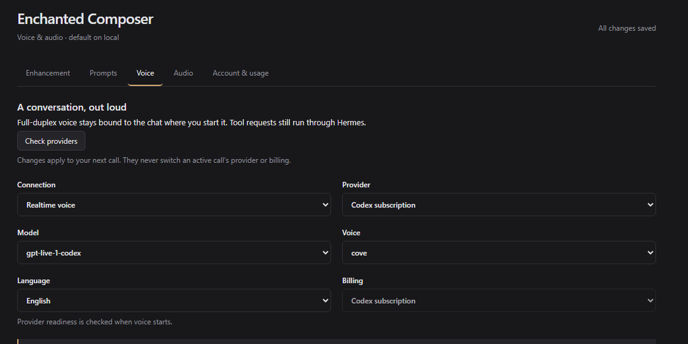

# Enchanted Composer



Enchanted Composer 0.2 adds full-duplex voice, reusable prompt libraries, draft enhancement, and multi-step undo/redo to Hermes Desktop. It leaves Hermes's native send, model, dictation, and voice controls intact.

## What's new

- **Start from an unsent chat.** Enhance a draft without creating or sending a chat turn. Starting voice explicitly creates and opens a real owner-bound chat before acquiring the microphone.
- **Reliable enhancement history.** Undo/redo supports up to 30 revisions per chat, survives editor remounts for saved chats, preserves whitespace, and refuses to overwrite manual edits. No repeat model call is needed for redo.
- **Voice that explains failures.** Recoverable transport warnings no longer end the call. A disconnected peer gets a bounded recovery window; terminal errors retain diagnostics and expose an explicit same-chat retry. Interruption resumes playback on the next response. Stop/dispose fences late negotiation results and cancels delegated work.
- **Simpler settings.** Enhancement, Prompts, Voice, Audio, and Account & usage have separate responsibilities. Voice/audio edits autosave in order with server read-back; failed saves retain pending edits and offer retry. Prompt and enhancement preferences save locally. Incomplete prompt drafts survive page changes.
- **Optional captions.** The temporary voice transcript is collapsed by default. Full-duplex voice still delegates tool requests to Hermes; those requests and their results appear in the captured chat.

## Compatibility and identity

The public product name and settings route are **Enchanted Composer** and `/enchanted-composer`. The technical install ID remains `composer-enhancements` so existing plugin enablement, prompt libraries, backend routes, and stored preferences are not orphaned. The old Desktop settings route remains an alias. Wire backend IDs and upstream attribution are intentionally preserved; the UI calls them **Realtime voice** and **Custom voice bridge**.

No credentials are migrated. Existing renderer voice defaults are adopted by only the first owner with no backend settings. New pending and saved settings are isolated by connection plus profile. Prompt libraries remain device-local under the existing namespace. Codex authentication remains owned by the official Codex CLI; this plugin never reads, refreshes, backs up, or writes Codex OAuth files.

## Security and catalog disclosures

Enchanted Composer has no telemetry and does not self-update. Catalog releases are updated only by a reviewed commit-SHA bump.

- **Network access:** the Desktop half calls only its owner-scoped Hermes plugin API and the focused Hermes gateway. An explicitly configured API-billing lane sends SDP to `COMPOSER_REALTIME_OFFER_URL`; an explicitly configured custom bridge opens the user-provided `wss://` endpoint. The official Codex CLI may contact OpenAI while serving an explicitly started subscription voice call. Delegated tool requests call the local Hermes API.
- **Processes:** subscription voice starts the discovered official `codex app-server` executable as a bounded child process and stops it when the voice session closes. The plugin does not invoke a shell and does not inherit or enable Hermes YOLO/approval bypass modes.
- **Credentials:** API billing reads `COMPOSER_OPENAI_API_KEY` or `OPENAI_API_KEY`; bridge proofs read `COMPOSER_BRIDGE_SHARED_SECRET`; local Hermes delegation uses Hermes's scoped `API_SERVER_KEY`. These values remain backend-side. The plugin does not read or modify another client's OAuth files and provides no sign-in or logout flow.
- **Filesystem reads:** the backend discovers the configured/PATH Codex executable and reads at most 4,000 characters from the captured Hermes profile's `SOUL.md` to preserve that profile's voice identity. It does not scan browser profiles or unrelated user files.
- **Stored data:** non-secret voice settings and bounded local activity totals are stored under a hashed connection-and-profile scope in `HERMES_HOME`; prompt libraries and pending non-secret UI edits use namespaced plugin storage. Temporary voice transcripts are cleared at call start/end.
- **Device access:** microphone permission is requested only for explicit device discovery or when the user starts voice. Temporary discovery streams and active call tracks are released during cleanup.

## Build and verify

```sh
python scripts/build_desktop.py
python scripts/build_dashboard.py
python scripts/build_desktop.py --check
python scripts/build_dashboard.py --check
node --test tests/desktop/*.test.mjs tests/dashboard/*.test.mjs
python -m pytest -q
python -m ruff check dashboard tests scripts
node scripts/verify_desktop.mjs desktop/plugin.js
python scripts/package.py --output dist/enchanted-composer-0.2.0.zip
hermes plugins validate . --json
```

or 

```bash
python scripts/build_desktop.py
python scripts/build_dashboard.py
python scripts/build_desktop.py --check
python scripts/build_dashboard.py --check
node --test tests/desktop/*.test.mjs tests/dashboard/*.test.mjs
python -m pytest -q
python -m ruff check dashboard tests scripts
node scripts/verify_desktop.mjs desktop/plugin.js
python scripts/package.py --output dist/enchanted-composer-0.2.0.zip
hermes plugins validate . --json
```

Install the unified archive through Hermes Plugins and enable both its backend and Desktop half. New backend routes require a normal backend lifecycle; replacing renderer JavaScript alone is not a complete upgrade. See [installation](docs/installation.md) and [migration](docs/migration.md).

## Current boundary

Ordinary voice turns remain temporary: this release does **not** synchronize both sides of voice into durable Hermes history. Delegation is retained intentionally. A ChatGPT-like phone client is not included. Actual microphone/provider acceptance must be checked in the installed host; mocks and isolated UI checks are not evidence of a successful paid voice call.

Subscription voice uses a local Codex app-server and relies on the CLI's own authentication state. API billing and custom bridges must be configured explicitly; no silent provider or billing fallback is introduced. Credentials stay backend-side. See [architecture](docs/architecture.md), [limitations](docs/limitations.md), and [privacy](docs/privacy-and-security.md).

## Provenance

Enchanted Composer's product design and implementation are original. No external plugin source, UI, CSS, images, or generated runtime files are included.
